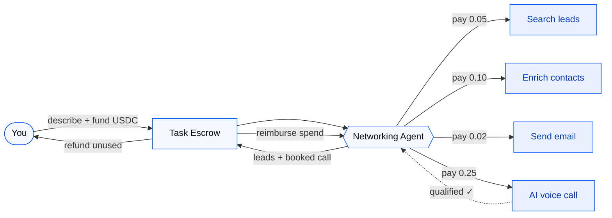

<div class="badges">
  <span class="badge badge-base">Base</span>
  <span class="badge badge-privy">Privy</span>
  <span class="badge badge-x402">x402</span>
  <span class="badge badge-eleven">ElevenLabs</span>
  <span class="badge badge-usdc">USDC</span>
</div>

<h1 class="title-glow">Relay</h1>

<p class="tagline">Your networking agent — finds, reaches out, books.</p>

<p class="subtitle">
Tell Relay who you want to meet. It searches for leads, sends email,<br/>
places AI voice calls, and books the meeting — paying for every tool<br/>
it uses along the way, autonomously in USDC on Base.
</p>

<div class="abs-br">
  <span class="muted">Built on Base · Privy · x402</span>
</div>

<!--
Opening line: Everyone says "AI agents will do work for you." But the moment an
agent needs to pay for a search API, an enrichment lookup, or a phone call, it
hits a wall — software can't use a credit card for thousands of micro-decisions.
We built Relay, a networking agent that pays for the services it consumes,
autonomously, in USDC on Base, with a budget you set and a ledger you can audit.
-->

<style>
:root {
  --cb-blue: #0052FF;
  --cb-blue-hover: #0040CC;
  --cb-blue-light: #EBF0FF;
  --cb-blue-muted: #4D7CFF;
  --cb-bg: #FFFFFF;
  --cb-bg-subtle: #F7F8FA;
  --cb-text: #0A0B0D;
  --cb-text-secondary: #5B616E;
  --cb-border: #E5E8EB;
  --card-bg: #FFFFFF;
  --card-border: #E5E8EB;
}
.slidev-layout {
  background:
    radial-gradient(900px 480px at 85% -5%, rgba(0,82,255,0.07), transparent 55%),
    radial-gradient(700px 400px at 5% 105%, rgba(0,82,255,0.04), transparent 50%),
    var(--cb-bg);
  color: var(--cb-text);
  font-weight: 400;
}
.slidev-layout h1 {
  color: var(--cb-text);
  letter-spacing: -0.03em;
  font-weight: 700;
  line-height: 1.1;
}
.slidev-layout h2, .slidev-layout h3 {
  color: var(--cb-text);
  letter-spacing: -0.02em;
  font-weight: 600;
}
.slidev-layout h1 + p, .slide-head + p { margin-top: 0.35rem; }
.slidev-layout h1.title-glow {
  font-size: 5.5rem;
  font-weight: 800;
  margin: 0.15em 0 0;
  letter-spacing: -0.04em;
  color: var(--cb-blue) !important;
  -webkit-text-fill-color: var(--cb-blue);
}
.tagline {
  font-size: 1.65rem;
  font-weight: 600;
  color: var(--cb-text);
  margin-top: 0.4em;
  letter-spacing: -0.02em;
}
.subtitle {
  font-size: 1.1rem;
  color: var(--cb-text-secondary);
  line-height: 1.65;
  margin-top: 1.1em;
  max-width: 52rem;
}
.muted { color: var(--cb-text-secondary); font-size: 0.82rem; }
.eyebrow {
  font-size: 0.72rem;
  font-weight: 700;
  letter-spacing: 0.14em;
  text-transform: uppercase;
  color: var(--cb-blue);
}
.badges { display: flex; gap: 0.5rem; justify-content: center; margin-bottom: 0.75rem; flex-wrap: wrap; }
.badge {
  font-size: 0.72rem;
  font-weight: 600;
  padding: 0.32em 0.85em;
  border-radius: 999px;
  border: 1px solid var(--cb-border);
  background: var(--cb-bg-subtle);
  color: var(--cb-text-secondary);
}
.badge-base   { color: var(--cb-blue); background: var(--cb-blue-light); border-color: rgba(0,82,255,0.2); }
.badge-privy  { color: #5B21B6; background: #F3E8FF; border-color: rgba(91,33,182,0.15); }
.badge-x402   { color: #0052FF; background: var(--cb-blue-light); border-color: rgba(0,82,255,0.2); }
.badge-eleven { color: #6D28D9; background: #F5F3FF; border-color: rgba(109,40,217,0.15); }
.badge-usdc   { color: #1D4ED8; background: #EFF6FF; border-color: rgba(29,78,216,0.15); }
.abs-br { position: absolute; right: 2rem; bottom: 1.5rem; }

.card {
  border: 1px solid var(--card-border);
  border-radius: 16px;
  background: var(--card-bg);
  padding: 1.15rem 1.3rem;
  box-shadow: 0 1px 3px rgba(10,11,13,0.06), 0 4px 16px rgba(10,11,13,0.04);
  transition: border-color 0.2s ease, box-shadow 0.2s ease;
}
.card:hover {
  border-color: rgba(0,82,255,0.35);
  box-shadow: 0 4px 24px rgba(0,82,255,0.1);
}
.card h3 { margin-top: 0; font-size: 1rem; color: var(--cb-text); }
.card-icon {
  width: 2.5rem;
  height: 2.5rem;
  border-radius: 12px;
  display: flex;
  align-items: center;
  justify-content: center;
  font-size: 1.25rem;
  margin-bottom: 0.6rem;
  background: var(--cb-blue-light);
  border: 1px solid rgba(0,82,255,0.12);
}
.accent { color: var(--cb-blue); }
.blue { color: var(--cb-blue); }
.violet { color: #6D28D9; }
.body-text { color: var(--cb-text-secondary); }
.highlight-line {
  font-size: 1.15rem;
  padding: 0.85rem 1.1rem;
  border-radius: 12px;
  border-left: 3px solid var(--cb-blue);
  background: var(--cb-blue-light);
  color: var(--cb-text);
}
.ledger {
  font-family: 'JetBrains Mono', monospace;
  font-size: 0.88rem;
  line-height: 2;
  border: 1px solid var(--cb-border);
  border-radius: 14px;
  background: var(--cb-bg-subtle);
  padding: 1.25rem 1.5rem;
  box-shadow: inset 0 1px 0 rgba(255,255,255,0.8);
}
.ledger .pay { color: #B45309; }
.ledger .ok { color: var(--cb-blue); }
.slidev-layout table {
  font-size: 0.88rem;
  border-collapse: separate;
  border-spacing: 0;
  width: 100%;
}
.slidev-layout th {
  text-align: left;
  font-weight: 600;
  color: var(--cb-text-secondary);
  font-size: 0.75rem;
  text-transform: uppercase;
  letter-spacing: 0.06em;
  padding: 0.65rem 0.9rem;
  border-bottom: 1px solid var(--cb-border);
  background: var(--cb-bg-subtle);
}
.slidev-layout td {
  padding: 0.7rem 0.9rem;
  border-bottom: 1px solid var(--cb-border);
  color: var(--cb-text);
}
.slidev-layout tr:hover td { background: var(--cb-blue-light); }
.slidev-layout a { color: var(--cb-blue); }
.slidev-layout code {
  font-size: 0.85em;
  padding: 0.15em 0.45em;
  border-radius: 6px;
  background: var(--cb-blue-light);
  border: 1px solid rgba(0,82,255,0.12);
  color: var(--cb-blue-hover);
}

.arch {
  display: flex;
  flex-direction: column;
  gap: 0.85rem;
  margin-top: 1.25rem;
  font-size: 0.82rem;
}
.arch-box {
  border-radius: 14px;
  border: 1px solid var(--card-border);
  background: var(--card-bg);
  padding: 0.9rem 1rem;
  box-shadow: 0 1px 3px rgba(10,11,13,0.05);
}
.arch-box--primary {
  border-color: rgba(0,82,255,0.3);
  background: linear-gradient(145deg, var(--cb-blue-light), #FFFFFF);
  box-shadow: 0 4px 20px rgba(0,82,255,0.08);
}
.arch-box--tools {
  border-color: rgba(0,82,255,0.2);
  background: var(--cb-bg-subtle);
}
.arch-label {
  font-size: 0.68rem;
  font-weight: 700;
  letter-spacing: 0.1em;
  text-transform: uppercase;
  color: var(--cb-text-secondary);
  margin-bottom: 0.5rem;
}
.arch-title { font-weight: 600; color: var(--cb-text); margin-bottom: 0.35rem; }
.arch-detail { color: var(--cb-text-secondary); line-height: 1.45; font-size: 0.78rem; }
.arch-tool {
  text-align: center;
  padding: 0.75rem 0.5rem;
  border-radius: 12px;
  border: 1px solid rgba(0,82,255,0.15);
  background: var(--cb-blue-light);
}
.arch-tool-name { font-weight: 600; color: var(--cb-text); font-size: 0.78rem; }
.arch-tool-price {
  font-family: 'JetBrains Mono', monospace;
  color: var(--cb-blue);
  font-size: 0.72rem;
  margin-top: 0.2rem;
}
.arch-arrow {
  text-align: center;
  color: var(--cb-blue);
  font-size: 1.1rem;
  opacity: 0.5;
  line-height: 1;
}
.arch-footer { margin-top: 0.5rem; }

.slidev-layout .mermaid { margin: 0 auto; }
.slidev-layout .mermaid svg { filter: drop-shadow(0 2px 8px rgba(0,82,255,0.08)); }
</style>

---
layout: center
class: text-left
---

<p class="eyebrow mb-2">The problem</p>

# Networking is the highest-leverage work — and the most manual

<div class="grid grid-cols-2 gap-8 mt-8">

<div class="card">

### The job today

- Hunt for the right people across tools & tabs
- Pay monthly for search, enrichment, email, dialers
- Write every message, make every call by hand
- Chase replies and juggle calendars for one meeting

</div>

<div class="card">

### Why AI agents can't fix it yet

- They can draft a message — but **can't buy** a search
- No way to pay an API **per call**, on the fly
- No phone — they can't actually **call** a lead
- "Give an agent your card" is a non-starter

</div>

</div>

<p class="mt-8 highlight-line"><span class="blue">The gap:</span> agents can think and write, but they can't <em>transact</em>. So they can't really do the work.</p>

---
layout: center
title: The insight
---

<p class="eyebrow">The insight</p>

<h1 class="text-5xl leading-tight mt-2">
An agent that can't <span class="opacity-60">pay</span> can't <span class="opacity-60">work</span>.
</h1>
<h1 class="text-5xl leading-tight accent">
So we gave it a wallet and a budget.
</h1>

<p class="subtitle mt-10 max-w-3xl mx-auto">
Relay handles the full networking loop — search, enrich, email, call, book — and pays
for each tool per use in USDC on Base. You get booked meetings, not another chatbot.
</p>

---

<p class="eyebrow mb-2">Product</p>

# What is Relay?

<p class="text-lg mt-1 body-text" style="max-width:52rem">
An <span class="accent">autonomous networking agent</span>. You describe who you want to meet and set a USDC budget. The agent finds the leads, reaches out by <span class="blue">email and AI voice call</span>, books the meeting, and pays for every tool it uses through <span class="blue">x402</span> — settled on Base.
</p>

<div class="grid grid-cols-3 gap-6 mt-10">

<div class="card">
<div class="card-icon">🎯</div>

**Describe & fund**

Log in with email, describe your ideal leads in plain language, set a USDC budget. Privy creates your wallet and funds escrow.
</div>

<div class="card">
<div class="card-icon">🤖</div>

**Agent hires its tools**

It searches, enriches, drafts outreach with an LLM, **emails** and **calls** leads — paying each x402 tool per use in USDC.
</div>

<div class="card">
<div class="card-icon">📅</div>

**Meeting booked & settled**

You get contact data + call outcomes + a booked meeting. Approve, and escrow reimburses real spend and refunds the rest.
</div>

</div>

<p class="mt-8 muted">Privy handles onboarding & wallets · Base settles every payment · x402 lets the agent buy tools · ElevenLabs makes the calls.</p>

---
layout: center
---

<p class="eyebrow mb-2">Flow</p>

# How it works



<p class="text-center muted mt-4">Each tool replies <span class="blue">402 Payment Required</span> → the agent wallet signs a USDC payment → response unlocked. No human in the loop.</p>

---

<p class="eyebrow mb-2">Demo artifact</p>

# The money shot: a transparent payment trail

<div class="grid grid-cols-2 gap-8 mt-4">

<div class="ledger">
<div>Task funded:          <span class="ok">10.00 USDC</span></div>
<div>→ Search leads:       <span class="pay">0.05 USDC</span></div>
<div>→ Enrich contacts:    <span class="pay">0.10 USDC</span></div>
<div>→ Send emails (x3):   <span class="pay">0.06 USDC</span></div>
<div>→ AI voice calls (x2):<span class="pay">0.50 USDC</span></div>
<div class="opacity-50">────────────────────────────</div>
<div>Agent reimbursed:     <span class="ok">0.71 USDC</span></div>
<div>Creator refund:       <span class="ok">9.22 USDC</span></div>
</div>

<div>

### Why this matters

- Every paid tool call is **visible** and on-chain
- Every spend is **capped** by your budget policy
- The agent **only pays for what it uses**
- A judge understands x402 *without reading code*

<p class="mt-6 card">
<span class="accent">This is the demo artifact.</span> The live execution timeline + USDC ledger is the strongest screen in the product.
</p>

</div>

</div>

---

<p class="eyebrow mb-2">Live run</p>

# Live agent execution

| Step | Tool | Cost | Status | Tx / Proof |
|---|---|--:|---|---|
| Search leads | `/api/tools/search-contacts` | 0.05 USDC | <span class="accent">Paid</span> | ↗ |
| Enrich contact | `/api/tools/enrich-contact` | 0.10 USDC | <span class="accent">Paid</span> | ↗ |
| Send email | `/api/tools/send-email` | 0.02 USDC | <span class="accent">Paid</span> | ↗ |
| AI voice call | `/api/tools/place-call` | 0.25 USDC | <span class="accent">Paid</span> | ↗ |

<div class="ledger mt-6">
<div>1. Agent parsed your brief & ranked matching leads</div>
<div>2. Search API requested payment — <span class="pay">0.05 USDC</span></div>
<div>3. x402 payment signed &amp; settled on Base <span class="ok">✓</span></div>
<div>4. LLM drafted personalized email + call script</div>
<div>5. <span class="violet">ElevenLabs</span> placed the call — lead qualified <span class="ok">✓</span></div>
<div>6. Meeting confirmation sent · escrow settled <span class="ok">✓</span></div>
</div>

---
layout: center
---

<p class="eyebrow mb-2">Stack</p>

# The whole stack, and why each piece is here

<table class="mt-4">
<thead>
<tr><th>Tech</th><th>Role in Relay</th></tr>
</thead>
<tbody>
<tr><td><span class="badge badge-privy">Privy</span></td><td>Email login → instant embedded wallet, USDC funding, gas sponsorship. No seed phrases.</td></tr>
<tr><td><span class="badge badge-base">Base</span></td><td>Every payment settles in USDC on Base Sepolia — funding, tool spend, reimbursements, refunds.</td></tr>
<tr><td><span class="badge badge-x402">x402</span></td><td>The agent pays APIs per call over HTTP via <code>402 Payment Required</code>. The core innovation.</td></tr>
<tr><td><span class="badge badge-eleven">ElevenLabs</span></td><td>Real outbound AI voice calls (Conversational AI + Twilio) that talk to and qualify leads.</td></tr>
<tr><td>🧠 LLM</td><td>OpenAI / Anthropic draft personalized emails & call scripts; power the in-app chat.</td></tr>
<tr><td>✉️ Resend</td><td>Delivers the outreach emails and the meeting confirmation.</td></tr>
</tbody>
</table>

<p class="text-center text-xl mt-6 accent">Relay is the first networking agent that can actually spend money — safely.</p>

---

<p class="eyebrow mb-2">System design</p>

# Architecture

<div class="arch">

<div class="grid grid-cols-2 gap-4">
<div class="arch-box">
<div class="arch-label">Client</div>
<div class="arch-title">Your Browser</div>
<div class="arch-detail">Privy login + embedded wallet · Describe leads · Live execution dashboard</div>
</div>
<div class="arch-box arch-box--primary">
<div class="arch-label">Next.js App Server</div>
<div class="arch-title">Networking Agent Orchestrator</div>
<div class="arch-detail">Task API · x402 Buyer Client · LLM outreach · Escrow settlement</div>
</div>
</div>

<div class="arch-arrow">↓</div>

<div class="arch-box arch-box--tools">
<div class="arch-label">x402 Paid Tools</div>
<div class="grid grid-cols-4 gap-3 mt-2">
<div class="arch-tool"><div class="arch-tool-name">search-contacts</div><div class="arch-tool-price">0.05 USDC</div></div>
<div class="arch-tool"><div class="arch-tool-name">enrich-contact</div><div class="arch-tool-price">0.10 USDC</div></div>
<div class="arch-tool"><div class="arch-tool-name">send-email</div><div class="arch-tool-price">0.02 USDC</div></div>
<div class="arch-tool"><div class="arch-tool-name">place-call</div><div class="arch-tool-price">0.25 USDC</div></div>
</div>
</div>

<div class="arch-arrow">↓</div>

<div class="grid grid-cols-3 gap-4">
<div class="arch-box"><div class="arch-title violet">ElevenLabs + Twilio</div><div class="arch-detail">AI voice calls</div></div>
<div class="arch-box"><div class="arch-title blue">Resend</div><div class="arch-detail">Outreach email</div></div>
<div class="arch-box"><div class="arch-title accent">x402 Facilitator → Base</div><div class="arch-detail">USDC settlement on Base Sepolia</div></div>
</div>

</div>

<p class="muted arch-footer">Next.js 16 · React 19 · TypeScript · Tailwind · Privy · x402 · viem · ElevenLabs · Resend · OpenAI/Anthropic</p>

---

<p class="eyebrow mb-2">Trust</p>

# Safety is the differentiator

<p class="text-lg mt-1 body-text">An autonomous agent that spends money is scary by default. Relay makes it <span class="accent">bounded and inspectable</span>.</p>

<div class="grid grid-cols-2 gap-8 mt-6">

<div class="card">

### Spend policy (enforced per call)

```ts
type SpendPolicy = {
  allowedTools: string[]
  maxTotalSpendUsdc: number
  maxPerRequestUsdc: number
}
```

The agent checks this **before every paid call** and stops outreach the moment the budget is exhausted.

</div>

<div class="card">

### Guardrails

- Hard **budget cap** you set when funding
- Per-tool **allowlist** — no surprise spend
- **Only reimbursed** for what it actually used
- **You approve** final settlement
- Failed voice calls **auto-refund** the agent

</div>

</div>

<p class="text-center muted mt-6">Agents can spend money — but only within explicit budgets, on approved tools, with a full on-chain trail.</p>

---
layout: center
---

# Why this can win

<div class="grid grid-cols-2 gap-6 mt-6">

<div class="card">

### <span class="badge badge-base">Base</span> + <span class="badge badge-x402">x402</span>

> Base becomes the settlement layer for work done by agents.

Real USDC volume, real per-call commerce — agents as economic actors, not chatbots.
</div>

<div class="card">

### <span class="badge badge-privy">Privy</span>

> Privy turns Relay from a crypto tool into a normal product.

Email login + embedded wallets + gas sponsorship remove every ounce of friction.
</div>

<div class="card">

### <span class="badge badge-eleven">ElevenLabs</span>

> The agent doesn't just type — it talks.

Real AI voice calls qualify leads and make the outreach feel human.
</div>

<div class="card">

### 🧠 The idea

> An agent that can *pay* can finally *do the work*.

A complete, autonomous workflow — find → contact → call → book → settle.
</div>

</div>

---
layout: center
class: text-center
title: Thank you
---

<div class="badges">
  <span class="badge badge-base">Base</span>
  <span class="badge badge-privy">Privy</span>
  <span class="badge badge-x402">x402</span>
  <span class="badge badge-eleven">ElevenLabs</span>
  <span class="badge badge-usdc">USDC</span>
</div>

<h1 class="title-glow" style="font-size:3.8rem">Your networking, handled.</h1>

<p class="subtitle max-w-2xl mx-auto">
Relay finds your leads, sends outreach, places calls, and books the meeting —<br/>
paying for every tool along the way, autonomously in USDC on Base.<br/>
<span class="accent">Agent commerce for real networking work.</span>
</p>

<p class="muted mt-10">Thank you · Demo + repo available</p>
